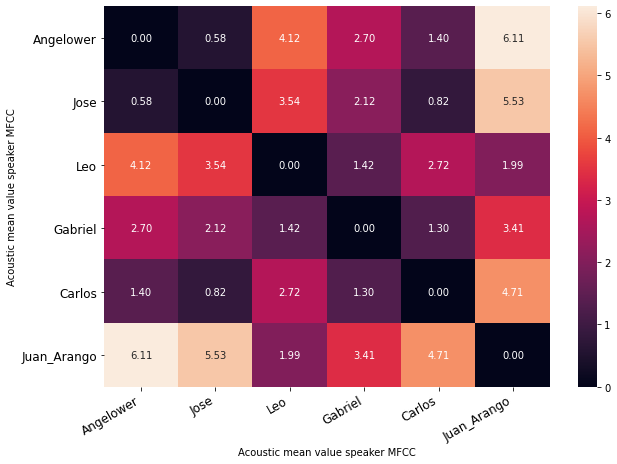
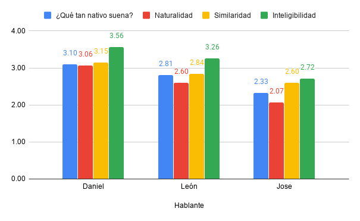

# A comparative analysis of training schemes for voice style transfer in Spanish

[@breakermoob](https://github.com/breakermoob), [@josearangos](https://github.com/josearangos), [@cdanmontoya](https://github.com/cdanmontoya) & [@jdariasl](https://github.com/jdariasl)

***Note:** This is a summary, for the full-length version please visit [this (spanish)](./src/informe.pdf).*

## Abstract

Voice conversion is a growing field of study with the arrival of Deep Neural Network architectures that allow to transfer the voice of a source speaker to a target speaker. Most of these architectures have been tested in English. In this report we compare, through perceptual measures, the performance of a model when performing voice style transfers in Spanish using three different schemas: training it with both English and Spanish audios, fine-tuning English-learned weights with Spanish audios and finally, training the model just with Spanish audios. We also explore speaker similarity measures based on euclidean distance and Kullback-Leibler divergence to try to explain the variations observed in the voice conversions between different speakers. Aditionally, we describe the application that we built to expose the best model as a web service. We conclude that for a better voice style transfer in Spanish, it is necessary to train the selected model directly with audios in Spanish.

## Methods

### Selected architecture
We choosed to work with the architecture proposed by [1], due to its capacity  to work with audios without transcription. Also, the authors published their [original implementation](https://github.com/jjery2243542/voice_conversion), making it easier for us to test and evaluate the architecture.

### Speakers similarity
As we experimented with the architecture, we noticed that there were performance variations depending on the source and target speakers, so we tought that it could be explained through the speakers voice similarity.

#### Measurement based on euclidean distance:
We used the method proposed by [3], using the audio MFCC as the characteristics vector.

 #### Measurement based on Kullback-Leibler divergence:
  We trained an UBM with all the audios in English. The UBM was built as a GMM and then we adapted the means vector to the Spanish speakers using a MAP estimation [4]. After that, we calculated the distance between each speaker's probability distribution using the Symmetric Kullback-Leibler Divergence, defined as:

Where D(λ1, λ2) is the Kullback-Leiber divergence, given by

λi represents i-th speaker model, and O(i) is the set of T samples of the i-th speaker.

### Model development and deployment

The project setup has a frontend developed in Angular and deployed using AWS Amplify. We used the frontend to show information about our project, gather users opinions and expose the voice conversion service. The survey answers are stored into a MongoDB Atlas via a Node.js backend deployed on Heroku Dyno, and the voice conversion service was developed using FastAPI and deployed on a GCP Compute Engine with a Tesla T4 GPU. This service uses the model and audios from an AWS S3 bucket.

\
*Fig 1: web application infraestructure*

## Experiments

### Database
To train our models we used the corpus provided by [2] and three members of our team recorded 400 audios in Spanish each one.

### Experimental phase
We trained four models to compare them and find which approximation brings the best results when performing a voice style transfer in Spanish.

- **M-Chou:** The first model was a replica of the training shown at [1]. We tried to get familiar with the implementation with this experiment.

- **M-Chou+3:** The second model was trained using audios in English and in Spanish as well. With this mixed dataset we tried to check if the model was able to extract features from the audios in English and take advantage of these features to improve the Spanish style transfers.

- **M-3SS:** The third model was trained using just the audios in Spanish. We tried to check if the model was able to extract enough features from a few speakers.

- **M-TL:** For the last model we tried to apply the *transfer learning* concept, taking the previously trained weights and *fine-tuning* them with the audios in Spanish. We replaced some layers due to the number of Spanish speakers in the training set. The best performance was achieved without freezing any layer. The replaced layers were

| Component           | Layer                        |
| ---                 | ---                          |
| SpeakerClassifier   | conv9                        |
| Decoder             | emb1, emb2, emb3, emb4, emb5 |
| Generator           | emb1, emb2, emb3, emb4, emb5 |
| PatchDiscriminator  | conv_classify                |

### Model evaluation
To evaluate the performance of the trained models we designed a survey to perform a Mean Opinion Score test [5]. Each user evaluated 6 pairs of audios of each model on four perceptual characteristics with a score from 0 up to 5. The evaluated characteristics were:

1. **Similarity:** How similar are both audios?
2. **Naturality:** Does the generated audio seem intoned by
a person or by a machine?
3. **Intelligibility:** How much can be understood of the generated audio?
4. **Nativeness:** Does the accent of the generated audio seem like a native-speaker recorded audio?

To improve users experience while taking the survey, we developed a web UI to collect the characteristics score.

\
*Fig 2: survey user interface*

After some data cleaning, we collected 591 valid evaluations.

\
*Fig 3: number of valid evaluations per model*

## Results

The movel M-3SS achieved the best perfermance in every single evaluated characteristic, as it can be seen in the following figure. The models which were trained with English and Spanish audios (M-TL and M-Chou+3) improved significantly the voice style transfer performance.

\
*Fig 4: performance per speaker*

To evaluate if the performance was affected by the speakers voice similarity or not, we measured the distance between the 3 speakers that recorded the training samples and 3 unseen speakers. We expected to see, for example, a low distance between León and the new speakers, because when we performed some transfers using them as source speakers we felt that León had the best performance of all target speakers, but we noticed a different behavior.

\
*Fig 5a: Speaker-verification-based distance between speakers*

\
*Fig 5b: Euclidean distance between speakers*

Instead of that, we can see a distance near to zero between Angelower and Jose & Carlos Daniel in the Fig 5a, while the distance between Angelower and León is much bigger. In the Gabriel's case we can notice a similar distance between him and León & Carlos Daniel in the figure 5b,  but in the figure 5a they have very different values. Due to this behavior, we can't explaint the observed performance variaton in the model for each target speaker, that can be seen in the figure 6.

\
*Fig 6: Performance per target speaker*

## Conclusions

The best performace was achievied by the model that was trained with just Spanish audios, this may be due to the fact that the acoustic, prosody and articulation of the languages are different and the model may have to adjust completely to perform a tranfer in a new language. We still need to check if transfer learning can be performed between speakers of the same language when adding a new speaker.

The transfers performance may be affected by the audio quality. We could not guarantee that there were the same technical conditions when we recorded the audios in Spanish. That may explain something of the performance variations shown in the figure 6. Also, may be that the selected speaker similarity measures were not adequate enough to explain the voice style transfers performance.

## Future work

* Build an Spanish corpus for voice style transferring and voice cloning.

* Explore more voice similarity measures.

## References

[1] [J.-c. Chou, C.-c. Yeh, H.-y. Lee, and L.-s. Lee, “Multi-target voice conversion without parallel data by adversarially learning disentangled audio representations,” arXiv preprint arXiv:1804.02812, 2018.](https://arxiv.org/abs/1804.02812)

[2] [C. Veaux, J. Yamagishi, and K. MacDonald, CSTR VCTK Corpus: English Multi-speaker Corpus for CSTR Voice Cloning Toolkit. University of Edinburgh. The Centre for Speech Technology Research (CSTR), 2017.](https://datashare.is.ed.ac.uk/handle/10283/2651)

[3] [M. K. Singh, N. Singh, and A. K. Singh, “Speaker’s voice characteristics and similarity measurement using euclidean distances” in 2019 International Conference on Signal Processing and Communication (ICSC), pp. 317–322, 2019.](https://ieeexplore.ieee.org/document/8938366)

[4] [D. A. Reynolds, T. F. Quatieri, and R. B. Dunn, “Speaker verificationusing adapted gaussian mixture models,” Digital Signal Processing, vol. 10, no. 1, pp. 19 – 41, 2000](https://www.sciencedirect.com/science/article/abs/pii/S1051200499903615)

[5] [Y. Jia, Y. Zhang, R. Weiss, Q. Wang, J. Shen, F. Ren, P. Nguyen, R. Pang, I. L. Moreno, Y. Wu, et al., “Transfer learning from speaker verification to multispeaker text-to-speech synthesis,” in Advances in neural information processing systems, pp. 4480–4490, 2018.](https://arxiv.org/abs/1806.04558)

# Authors
||||
|---|---|---|
|León Darío Arango Amaya | @breakermoob | leon.arango@udea.edu.co |
| Jose Alberto Arango Sánchez | @josearangos | jose.arangos@udea.edu.co |
| Carlos Daniel Montoya Hurtado | @cdanmontoya | carlos.montoya@udea.edu.co | 
| [Julián D. Arias](https://sites.google.com/site/juliandariaslondono) | @jdariasl | julian.ariasl@udea.edu.co |
